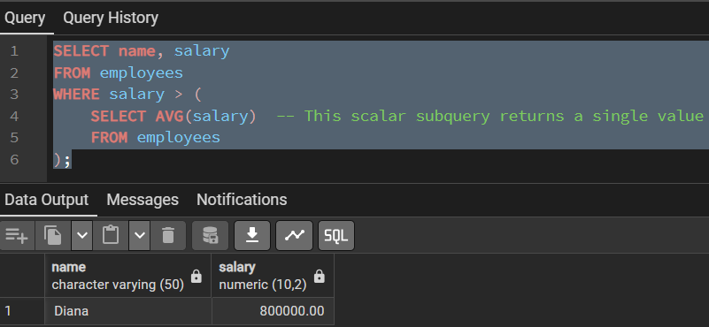
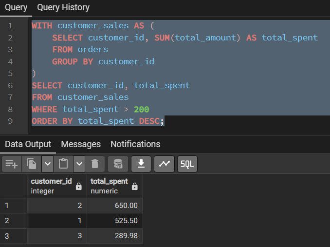
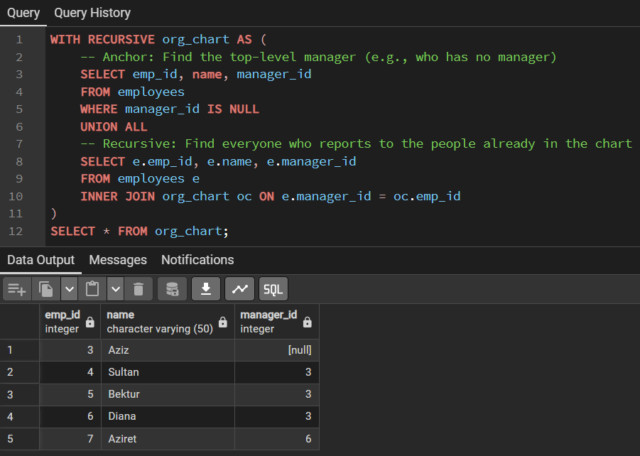
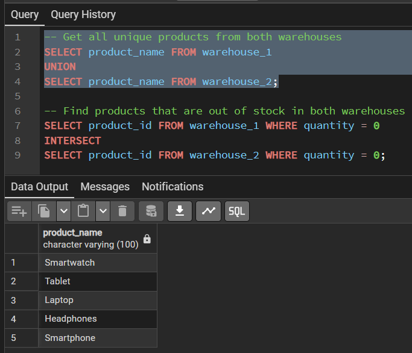
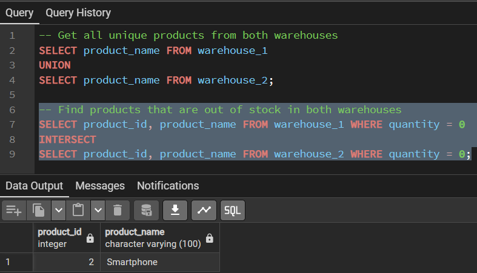
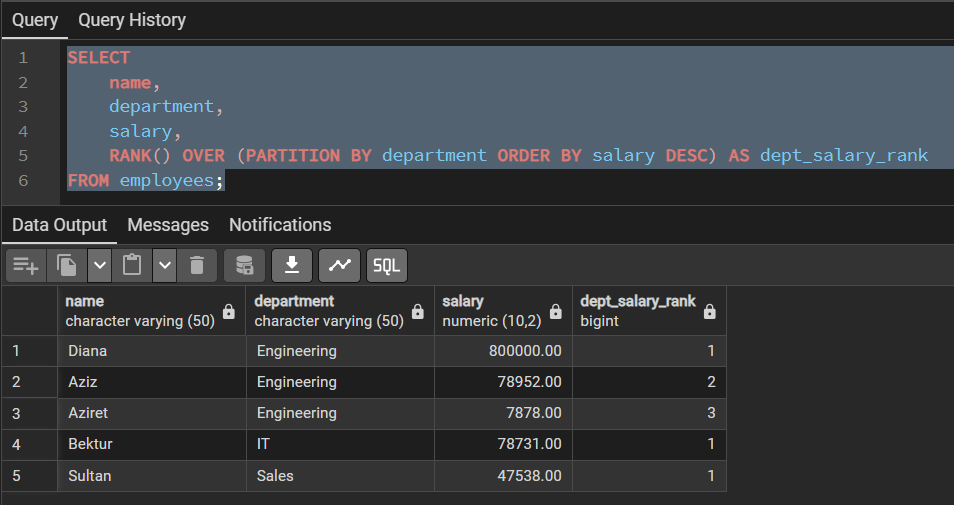
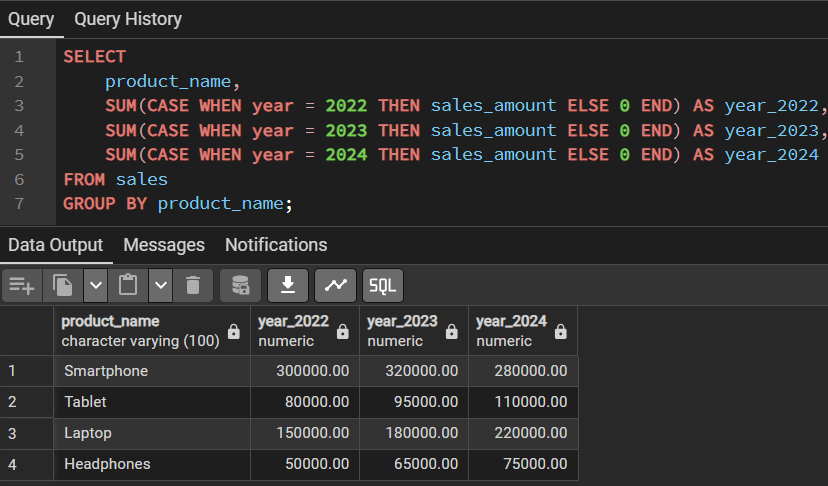
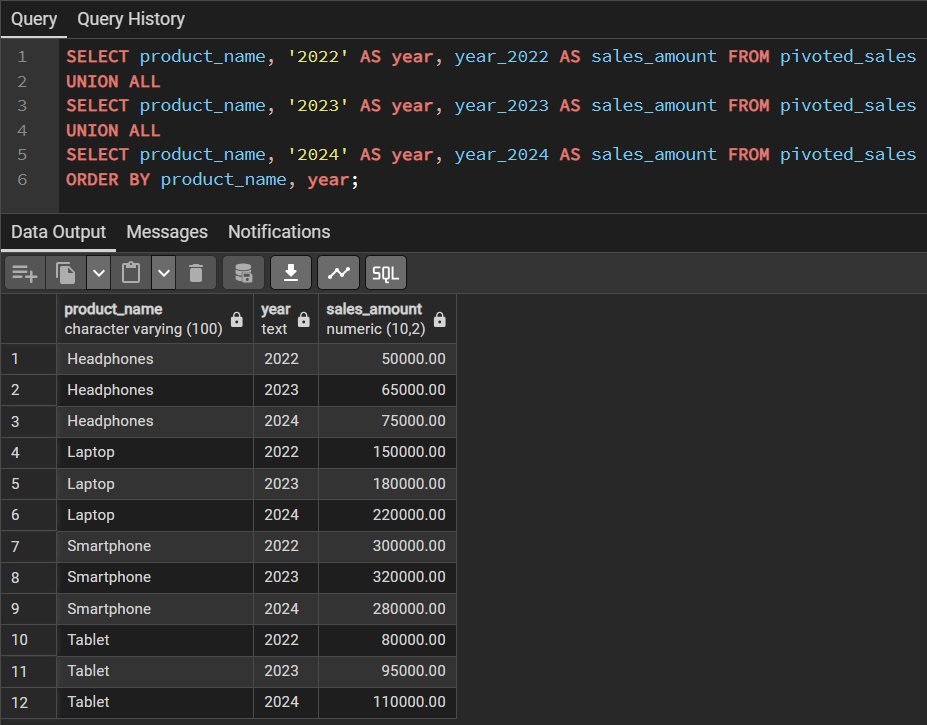
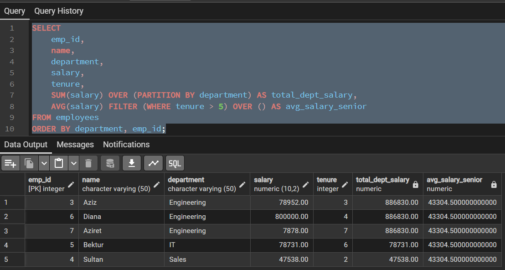
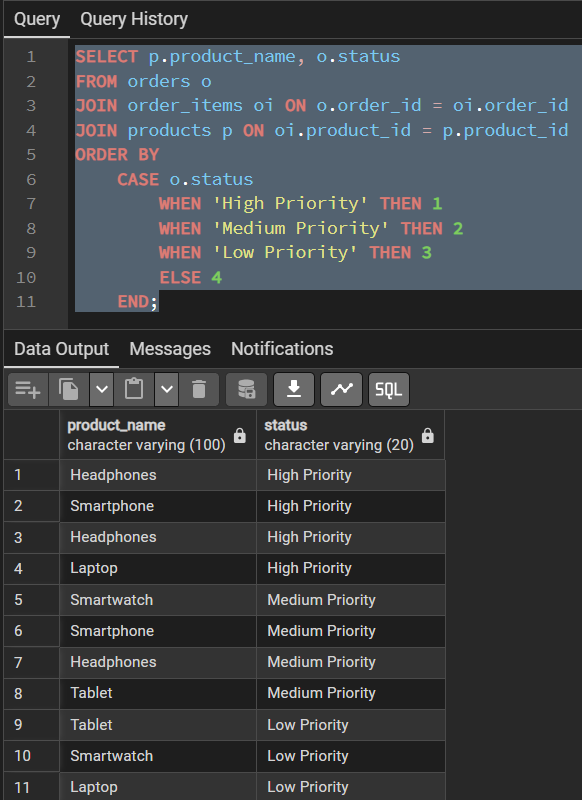

## **Subqueries**
---
A subquery (or inner query) is a query nested inside another SQL statement.

**Concept: Think of it as asking a question to answer a bigger question. The result of the inner query is used by the outer query.**

**Types:**
- **Scalar Subquery:** Returns a single value (one row, one column). Used with operators like =, >, <.
- **Row Subquery:** Returns a single row with multiple columns.
- **Table Subquery:** Returns a full result set (multiple rows and columns). Often used with IN, EXISTS, or FROM.

**Use Case:** Find all employees whose salary is above the company average.

**Example:**

## **Common Table Expressions (CTEs)**
---
CTEs, defined using the WITH clause, allow you to name a subquery and reference it later in your main query. They make your queries much more readable and modular.

**Concept: It's like defining a temporary view for the duration of your query.**  

**Syntax:**
`WITH cte_name AS (`  
    `SELECT ... FROM ...  -- Your subquery here`  
`)`  
`SELECT * FROM cte_name;  -- Your main query using the CTE`

**Example:**

**Use CTEs to break down complex problems into logical, manageable steps. This is often the cleanest solution.**

## **Recursive Queries**
---
A special form of CTE that allows you to query hierarchical or tree-structured data. A recursive CTE has two parts: a non-recursive term (the anchor) and a recursive term.

**Concept: It repeatedly executes the recursive term, using the results from the previous iteration, until it returns no more rows.**

**Syntax:**
`WITH RECURSIVE cte_name AS (`  
    `-- Anchor member: The starting point`  
    `SELECT ... FROM ... WHERE ...`  
    `UNION ALL`  
    `-- Recursive member: References the CTE itself`  
    `SELECT ... FROM cte_name JOIN ... WHERE ...`  
`)`  
`SELECT * FROM cte_name;`

**Example:**

## **Set Operations**
---
Set operations combine the results of two or more SELECT queries.
- **UNION:** Combines results and removes duplicates.
- **UNION ALL:** Combines results and keeps all duplicates (faster than UNION).
- **INTERSECT:** Returns only the rows that are present in both result sets.
* **EXCEPT** (or **MINUS** in some SQL dialects): Returns the rows from the first query that are not present in the second query.**

**Example:**

## **Window Functions & Partitioning**
---
Window functions perform a calculation across a set of table rows that are somehow related to the current row. Unlike GROUP BY, they do not cause rows to become grouped into a single output row.

**Key Clauses:**
- **OVER():** Defines the "window" of rows to perform the calculation on.
- **PARTITION BY:** Divides the result set into partitions (like groups) to perform the calculation within. Similar to GROUP BY but doesn't reduce rows.
* **ORDER BY:** Defines the order of rows within the window.

**Common Functions:** ROW_NUMBER(), RANK(), DENSE_RANK(), SUM(), AVG(), LAG(), LEAD()

**Example:**

## **Pivot and Unpivot Operations**
---
PostgreSQL doesn't have a native PIVOT/UNPIVOT operator like some other databases. Instead, we use the `crosstab()` function from the `tablefunc` module or conditional aggregation.

### **Pivoting with Conditional Aggregation (Most Common): 
Concept: Turning unique row values into columns.**

**Example:**

### **Unpivoting with UNION ALL:**
**Concept:** Turning columns into rows.

**Example:**

## **Complex Filtering and Sorting**
---
Go beyond basic WHERE and ORDER BY.

### **Filtering:**
* **FILTER Clause:** A cleaner way to apply aggregates to subsets of data, often used with window functions.

### **Sorting:**
* **Custom Sorting with CASE:** Force a specific, non-alphabetical order.

## **Query Optimization Techniques**
---
Writing a correct query is one thing; writing an efficient one is another.

### **EXPLAIN and EXPLAIN ANALYZE:**
Your most important tools. Prepend EXPLAIN or EXPLAIN ANALYZE to any query to see the execution plan the database will use.
- **EXPLAIN** shows the plan.
* **EXPLAIN ANALYZE** executes the query and shows actual runtime metrics.

### **Use Indexes:**
Indexes on columns used in WHERE, JOIN, and ORDER BY clauses can dramatically speed up queries.

### **Avoid SELECT * :**
Only select the columns you need. This reduces the amount of data transferred and processed.

### **Be cautious with DISTINCT and UNION:**
They require extra processing to remove duplicates. Use UNION ALL if you know duplicates are impossible or acceptable.

### **Use LIMIT for Testing:**
When building a complex query, use LIMIT 10 to get quick feedback instead of processing the entire table.