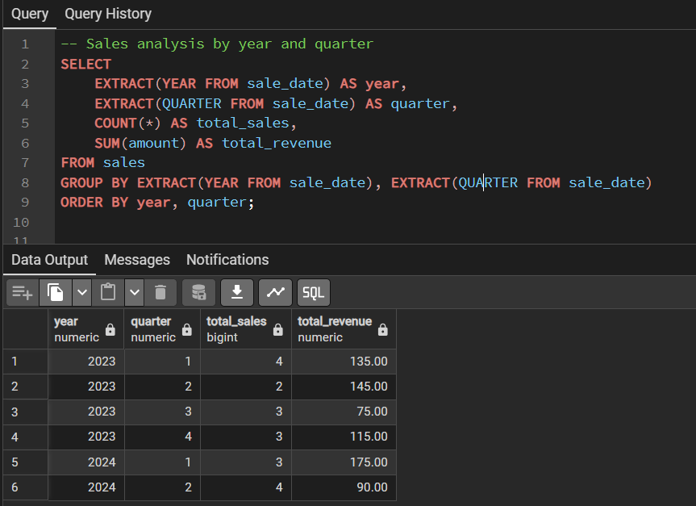

## **What Are Aggregate Functions?**
---
Aggregate functions operate on a set of values and return a single value as a result. They are typically used with the GROUP BY clause to group rows that have the same values in specified columns, and then perform calculations on each group. Think of aggregate functions as mathematical operations that "collapse" multiple rows into a single summary value. For example, if you have sales data for different months, you can use aggregate functions to calculate the total sales, average sales, or count the number of transactions.

## **Common Aggregate Functions**
---
### **COUNT() - Counting Rows**
The COUNT() function returns the number of rows that match a specified condition.

**Syntax:**
`-- Count all rows (including NULLs)`  
`COUNT(*)`  
`-- Count non-NULL values in a specific column`  
`COUNT(column_name)`  
`-- Count distinct values`  
`COUNT(DISTINCT column_name)`

**Examples:**

### **SUM() - Calculating Totals**
**The SUM() function calculates the total sum of numeric values.**

**Examples:**

## **AVG() - Calculating Averages**
The AVG() function calculates the arithmetic mean of numeric values.

**Examples:**

### **MAX() and MIN() - Finding Extremes**
These functions find the maximum and minimum values respectively.

**Examples:**

## **Advanced Aggregate Functions**
---
### **STRING_AGG() - Concatenating Strings**
Concatenates values from multiple rows into a single string with a specified delimiter.

**Examples:**

### **ARRAY_AGG() - Creating Arrays**
Collects values from multiple rows into an array.

### **Statistical Aggregate Functions**

## **Working with GROUP BY**
---
The GROUP BY clause is essential when using aggregate functions to group rows based on one or more columns.

**Basic GROUP BY**

**Multiple Column Grouping**

## **GROUP BY with Expressions**
---

## **HAVING Clause - Filtering Groups**
---
The HAVING clause filters groups created by GROUP BY, similar to how WHERE filters individual rows.

**Key difference: WHERE filters before grouping, HAVING filters after grouping.**

## **Window Functions vs Aggregate Functions**
---
While aggregate functions collapse rows, window functions perform calculations across rows while preserving individual row details.

### **Handling NULL Values**

## **Common Patterns and Best Practices**
---
### **1. Combining Multiple Aggregations**

### **2. Conditional Aggregation**

### **3. Percentage Calculations**

