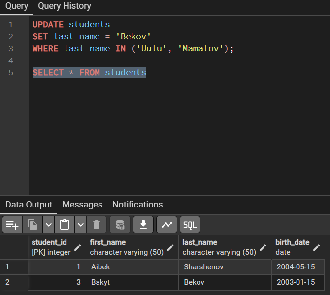

## **INSERT Statements**
---
**The INSERT statement is used to add new rows into a table.**

**Syntax:**
`INSERT INTO table_name (column1, column2, ...)`  
`VALUES (value1, value2, ...);`

## **UPDATE Statements**
---
The UPDATE statement modifies existing records.

It must usually be combined with a WHERE clause to avoid changing all rows.

**Syntax:**
`UPDATE table_name`  
`SET column1 = value1, column2 = value2, ...`  
`WHERE condition;

## **DELETE Statements**
---
**The DELETE statement removes rows from a table.**

**Syntax:**
`DELETE FROM table_name`  
`WHERE condition;`

**Important: Omitting WHERE will delete all rows in the table.**

## **Bulk Operations**
---
Bulk operations are used when working with large sets of data. PostgreSQL provides several methods:
- Insert multiple rows at once (as shown above with multiple VALUES).
- Using COPY for importing/exporting data The COPY command allows fast bulk insertion from CSV or text files.

**Example:**
`COPY Students(first_name, last_name, birth_date)`  
`FROM '/path/to/students.csv'`  
`DELIMITER ','`  
`CSV HEADER;`

**Where students.csv might contain:**
`first_name,last_name,birth_date`  
`Nursultan,Isakov,2002-04-10`  
`Meerim,Bekova,2003-06-12`  
`Tilek,Usubaliev,2001-11-05`

### **Bulk Update**

**You can update multiple rows in a single statement:**

### **Bulk Delete**
**Remove multiple rows with conditions:**

