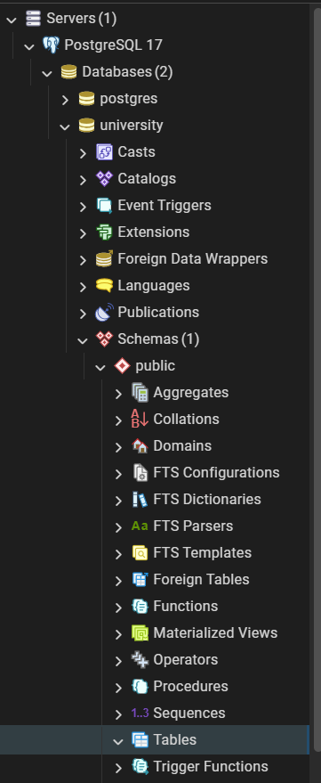

First of all, I have decided to create a separate database to work on during the class. I named it "university" for the simplicity sake.

## Basic Command-Line Operations:
---
I decided to run the following commands:

As you can see, everything worked. Now, I will drop the table:

There is no "students" table anymore.