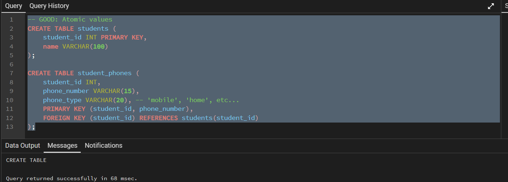
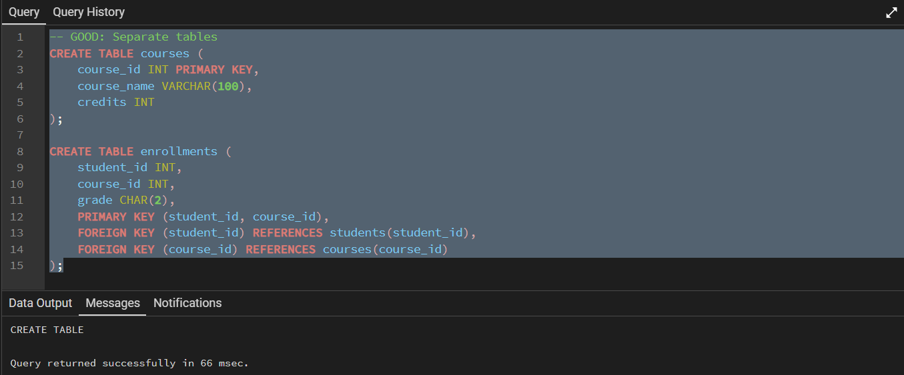
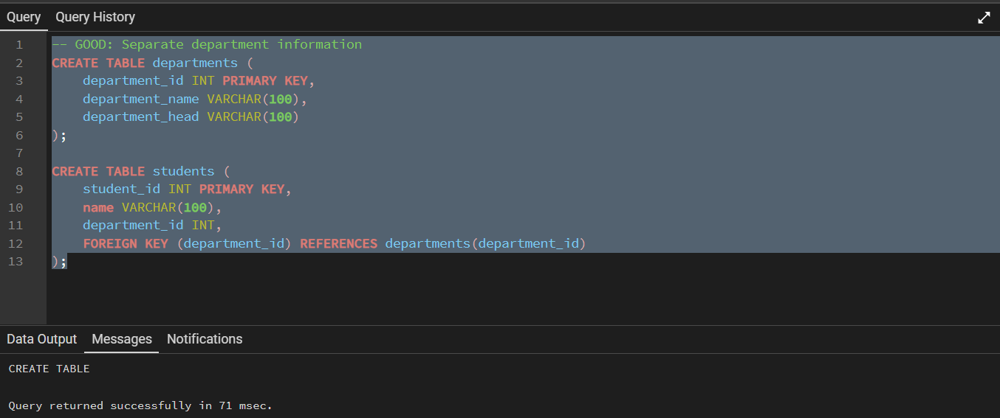
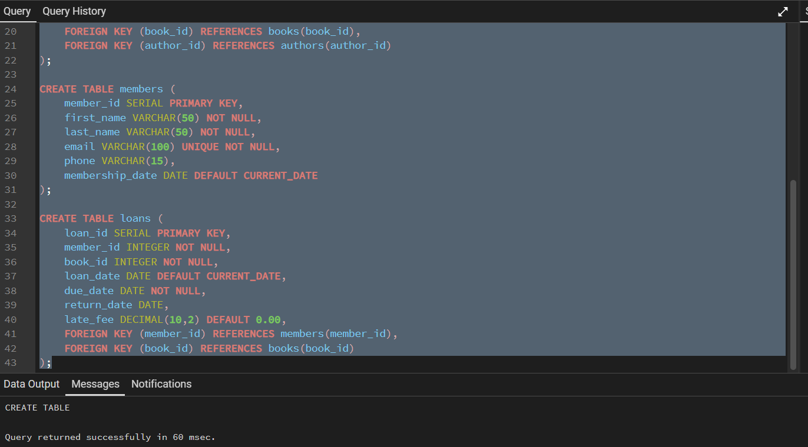

---

---
Database design is the process of creating a detailed data model of a database that defines how data is stored, organized, and accessed. Good database design is crucial for creating efficient, scalable, and maintainable applications. In this tutorial, we'll explore the fundamental concepts of database design using PostgreSQL as our DBMS.

## **Entity-Relationship Modeling**
---
Entity-Relationship modeling is a method used to represent the logical structure of a database graphically. It helps visualize how different pieces of data relate to each other before implementing the actual database.

### **Core Components of ER Models**
- Entity - A real-world object or concept that can be distinctly identified. Entities become tables in your database. **Examples: Student, Course, Professor, Department**
- Attribute - Properties or characteristics of an entity. Attributes become columns in your tables. **Examples: Student has attributes like StudentID, Name, Email, DateOfBirth**
- Relationship: Connections between entities that show how they interact. **Examples: Students enroll in Courses, Professors teach Courses**  

### **Types of Attributes**
- Simple Attributes - Cannot be divided further Example: StudentID, FirstName
- Composite Attributes - Can be divided into smaller parts Example: Address (can be divided into Street, City, ZipCode)
- Derived Attributes - Calculated from other attributes Example: Age (derived from DateOfBirth)
- Key Attributes - Uniquely identify an entity. Example: StudentID for Student entity

## **Normalization**
---
Normalization is the process of organizing data in a database to reduce redundancy and improve data integrity. It involves dividing large tables into smaller, related tables and defining relationships between them.

**Benefits of Normalization**:
- Eliminates data redundancy
- Reduces storage space
- Maintains data consistency
- Makes updates easier and safer

***Normal Forms*** - there are 7 forms, however only 3 used in most cases (99%)

### **First Normal Form (1NF)**
- Each column contains atomic (indivisible) values
- No repeating groups or arrays
- Each row is unique

**Example - Following 1NF:**

### **Second Normal Form (2NF)**
- Must be in 1NF
- No partial dependencies (non-key attributes must depend on the entire primary key)

**Example - Following 2NF:**

### **Third Normal Form (3NF)**
- Must be in 2NF
- No transitive dependencies (non-key attributes shouldn't depend on other non-key attributes)

**Example - Following 3NF:**

## **Database Design Process**
---
### **Step-by-Step Design Process**
#### **Requirements Analysis**
- Understand the business requirements
- Identify what data needs to be stored
- Understand how data will be used
- Identify user types and their needs

#### **Conceptual Design**
- Create high-level ER diagrams
- Identify major entities and relationships
- Don't worry about implementation details yet

#### **Logical Design**
- Convert ER diagrams to table structures
- Apply normalization rules
- Define primary and foreign keys
- Specify data types and constraints

#### **Physical Design**
- Choose appropriate data types for PostgreSQL
- Create indexes for performance
- Consider partitioning for large tables
- Plan for backup and recovery

### **Example: Designing a Library Management System**
#### **Requirements Analysis**
- Track books, authors, members, and borrowing history
- Members can borrow multiple books
- Books can have multiple authors
- Track due dates and late fees

#### **Conceptual Design**
**Entities:** Book, Author, Member, Loan
**Relationships:**
- Author WRITES Book (Many-to-Many)
- Member BORROWS Book through Loan (One-to-Many)

#### **Logical Design**

## **Identifying Entities and Attributes**
---
### **How to Identify Entities**

Look for Nouns in Requirements:
- "The library tracks books and members"
- "Students enroll in courses taught by professors"

Ask Key Questions:
- What things does the business need to track?
- What are the main objects in the system?
- What generates or receives data?

### **How to Identify Attributes**

Look for Descriptive Information:
- What information do we need to store about each entity?
- What properties are important for business operations?
- What data is required for reports and queries?