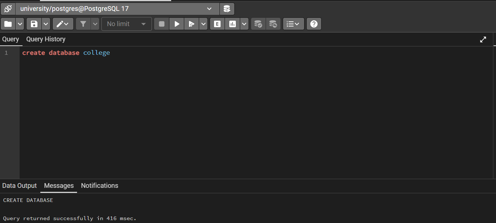
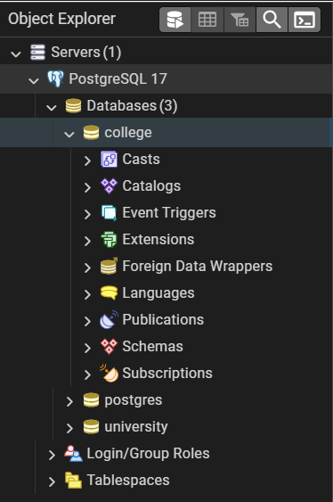
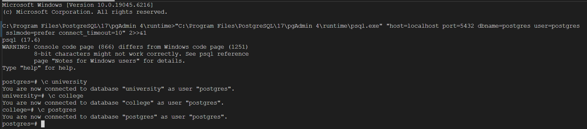
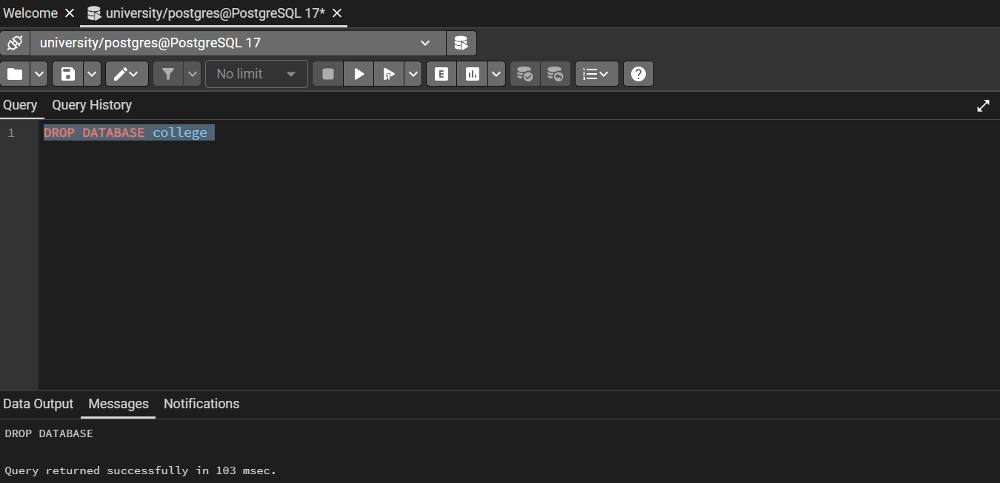
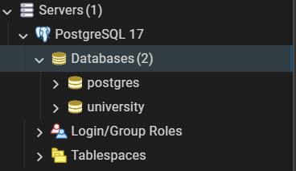

Since, I have already created a database "university", I will just create another one. I will call it "college":

Let's switch between the databases using psql command-line interface:

And finally, let's drop our newly made database. Right before that, I have promptly disconnected from it:

