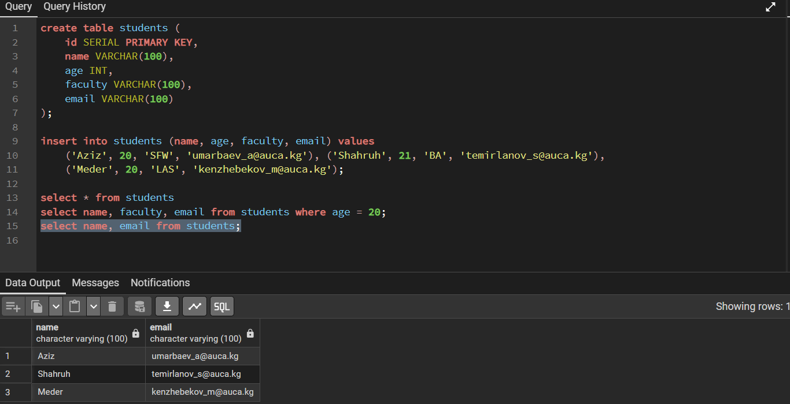
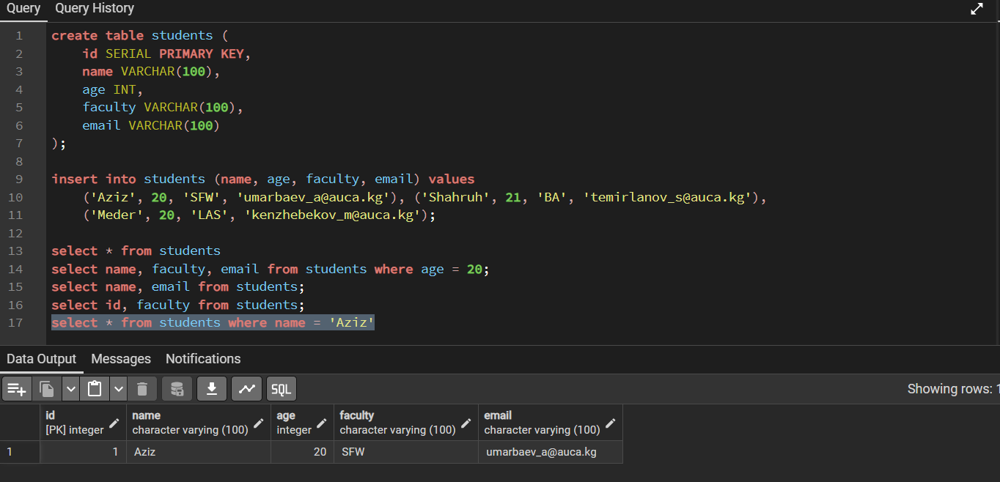

Before I start working with the queries, let's create a new table with more columns:

Now let's try to call different queries. For example, students' names, email and faculty, who are only 20 years old:

Now just the names and the emails of the students:

IDs and faculties only:

Now I want to check only my own data:

Next, let's order students by age, both ascending and descending:

Limit the number of rows returned:

And lastly, comments:

