SQL joins are used to combine rows from multiple tables based on a related column. They leverage the foreign key relationships we discussed earlier to create meaningful connections between data stored across different tables. Think of joins as a way to "reconstruct" related information that has been normalized across multiple tables. For example, if customer information is in one table and order information is in another, joins allow you to see customer details alongside their orders.

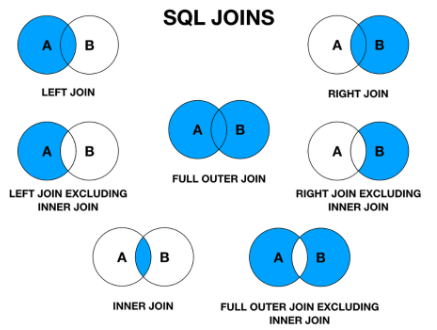

## **Types of Joins**
---
### **1. INNER JOIN**
An INNER JOIN returns only the rows that have matching values in both tables. This is the most restrictive type of join.

**Syntax:**
`SELECT columns`  
`FROM table1`  
`INNER JOIN table2 ON table1.column = table2.column;`

**Example: Let's say we have these tables:**

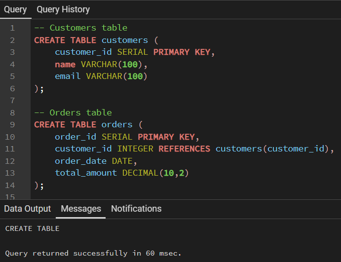

**INNER JOIN Query:**

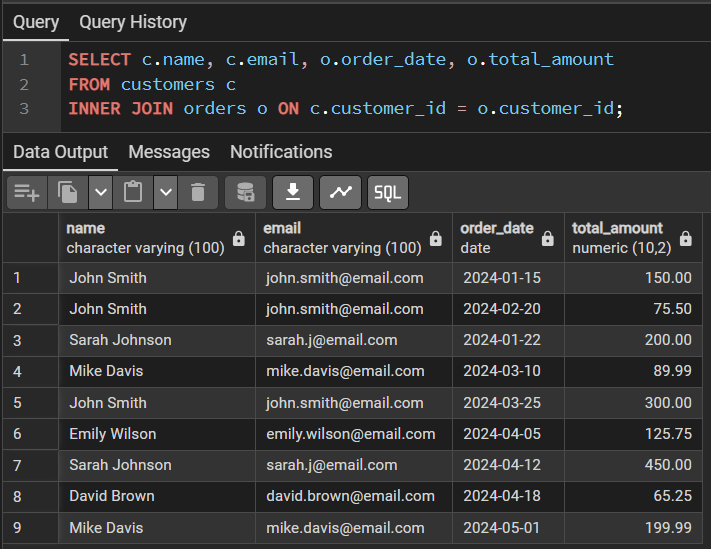

This query returns only customers who have placed orders, along with their order details.

### **LEFT JOIN (LEFT OUTER JOIN)**
A LEFT JOIN returns all rows from the left table and matching rows from the right table. If no match is found, NULL values are returned for the right table columns.

**Syntax:**
`SELECT columns`  
`FROM table1`  
`LEFT JOIN table2 ON table1.column = table2.column;*`

**Example:**

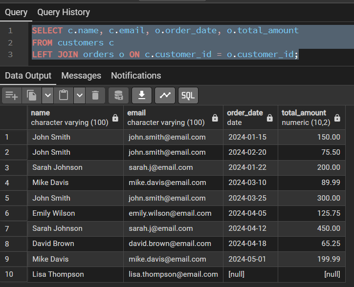

This query returns all customers, including those who haven't placed any orders (their order columns will show NULL).

### **3. RIGHT JOIN (RIGHT OUTER JOIN)**
A RIGHT JOIN returns all rows from the right table and matching rows from the left table. If no match is found, NULL values are returned for the left table columns.

**Syntax:**
`SELECT columns`  
`FROM table1`  
`RIGHT JOIN table2 ON table1.column = table2.column;`

**Example:**

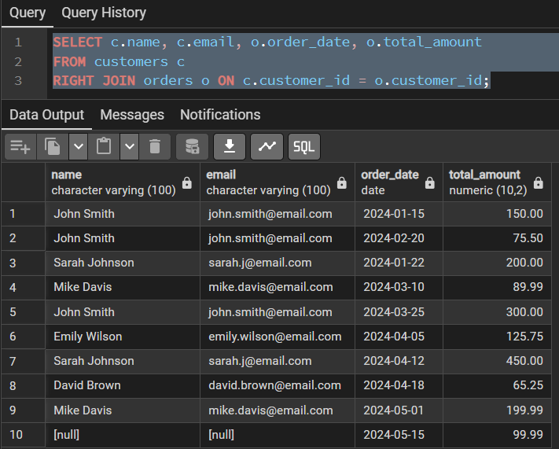

This query returns all orders, even if the customer information is missing (customer columns would show NULL).

### **4. FULL OUTER JOIN**
A FULL OUTER JOIN returns all rows when there's a match in either table. It combines the results of both LEFT and RIGHT joins.

**Syntax:**
`SELECT columns`  
`FROM table1`  
`FULL OUTER JOIN table2 ON table1.column = table2.column;`

**Example:**

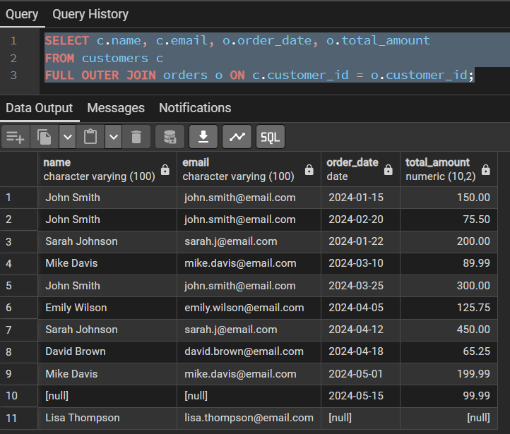

This query returns all customers and all orders, with NULL values where there's no match.

### **5. CROSS JOIN**
A CROSS JOIN returns the Cartesian product of both tables, meaning every row from the first table is combined with every row from the second table.

**Syntax:**
`SELECT columns`  
`FROM table1`  
`CROSS JOIN table2;`

**Example:**

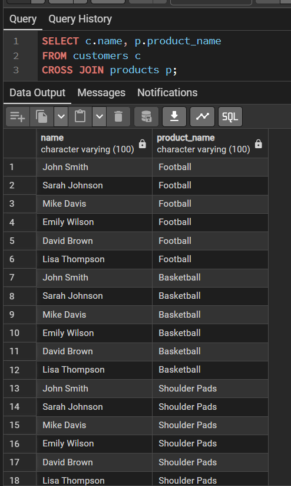

**Warning: Use CROSS JOIN carefully as it can produce very large result sets!**

## **Advanced Join Techniques**
---
### **Multiple Table Joins**
You can join more than two tables in a single query:

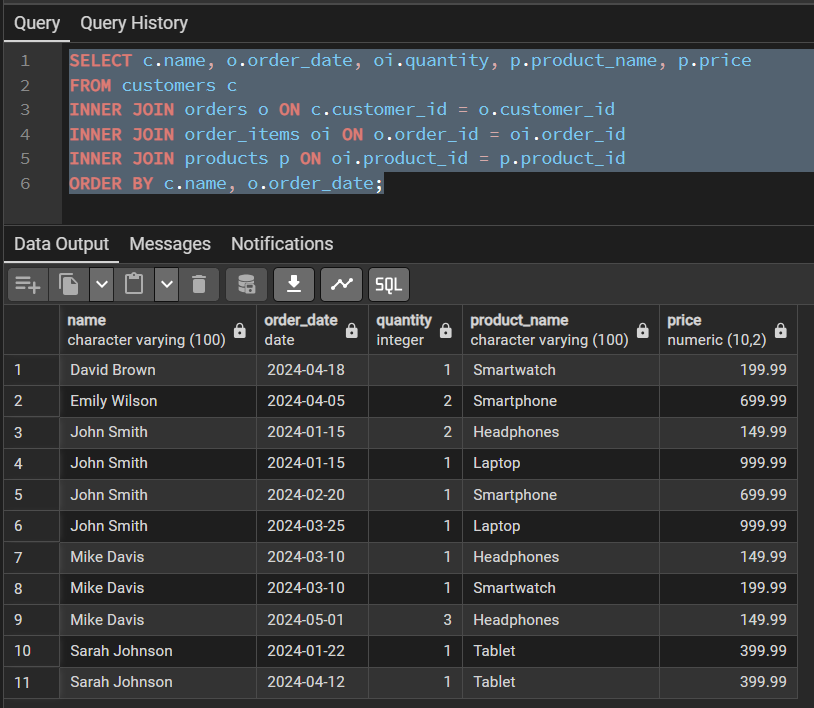

### **Self Joins**
A table can be joined with itself to compare rows within the same table:

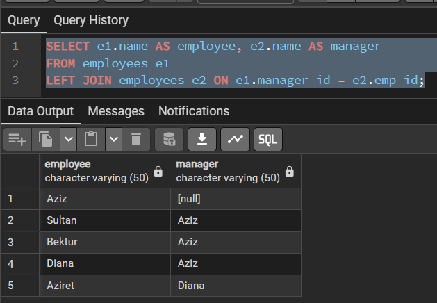

### **Join with Conditions**
You can add additional conditions to your JOIN clauses:

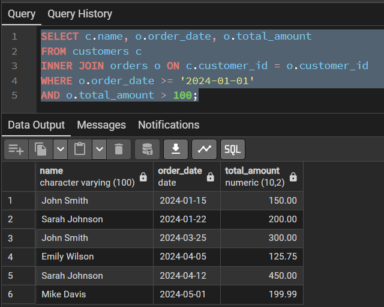

## **Working with Different Relationship Types**
---
### **One-to-One Relationships**
For one-to-one relationships, INNER JOIN or LEFT JOIN are typically used:

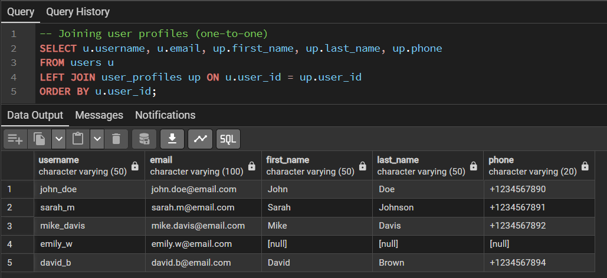

### **One-to-Many Relationships**
For one-to-many relationships, be aware that the "one" side may be repeated:

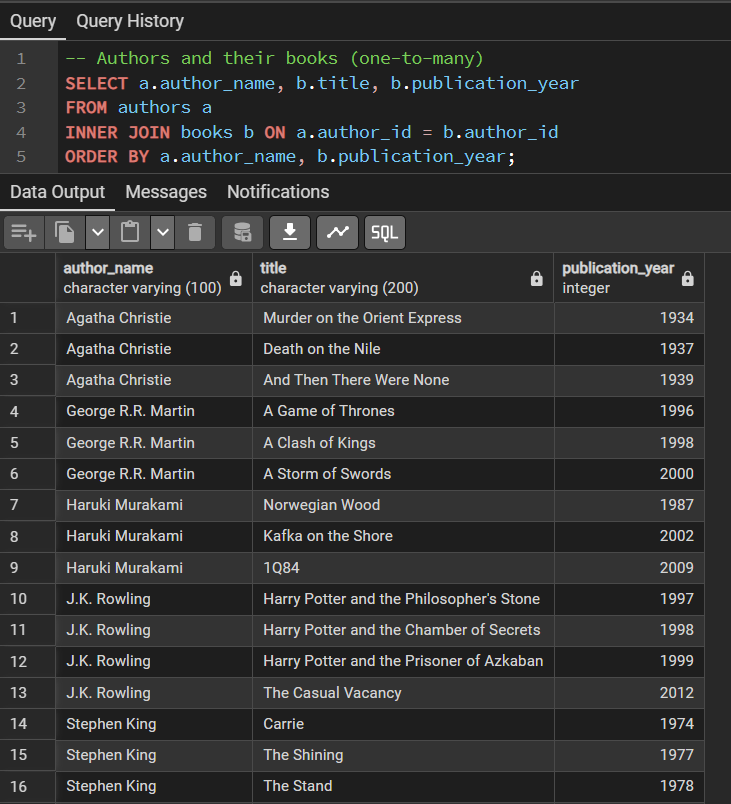

### **Many-to-Many Relationships**
For many-to-many relationships, you'll need to join through the junction table:

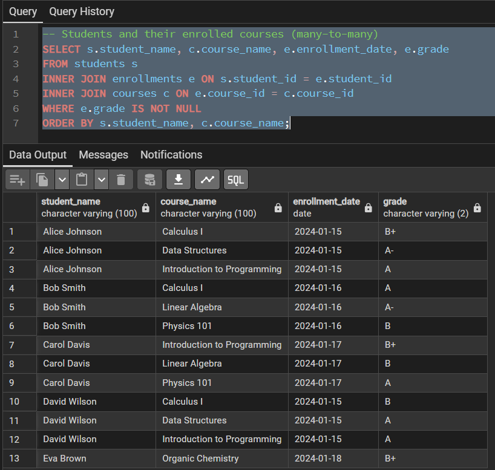

## **Performance Considerations**
---
### **Use Indexes**
Ensure foreign key columns and join columns have indexes:

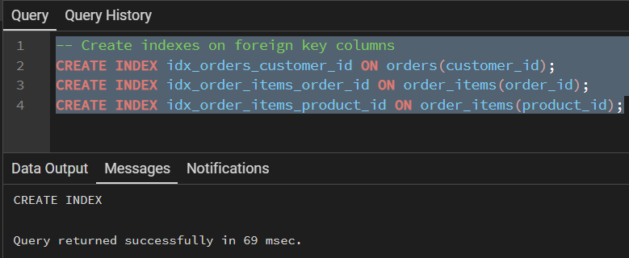

### **Choose the Right Join Type***
- Use INNER JOIN when you only need matching records
- Use LEFT JOIN when you need all records from the left table
- Avoid CROSS JOIN unless you specifically need a Cartesian product

### **Table Aliases**
Use table aliases to make queries more readable and potentially faster:

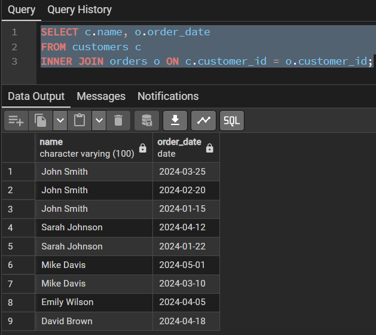

## **Common Pitfalls and How to Avoid Them**
---
### **1. Cartesian Products**
Problem: Forgetting the JOIN condition creates a Cartesian product. Solution: Always specify proper JOIN conditions.

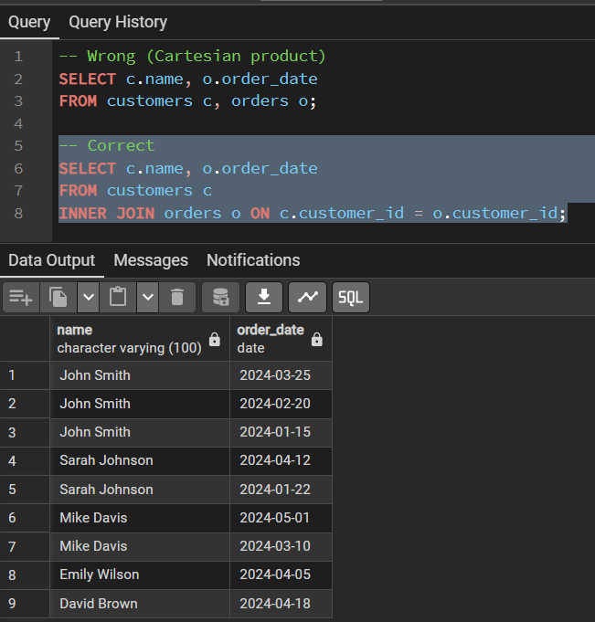

### **2. Null Value Confusion**
Problem: Not understanding how NULLs work in outer joins.

**Solution: Use IS NULL or IS NOT NULL appropriately.**

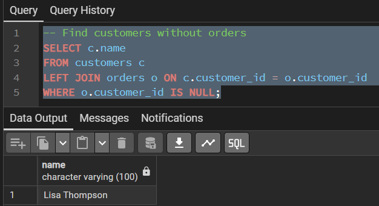

### **3. Many-to-Many Join Errors**
Problem: Forgetting to include the junction table. 

**Solution: Always join through the junction table for many-to-many relationships.**