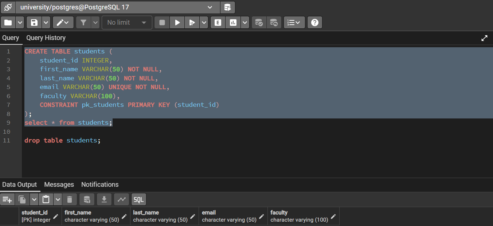
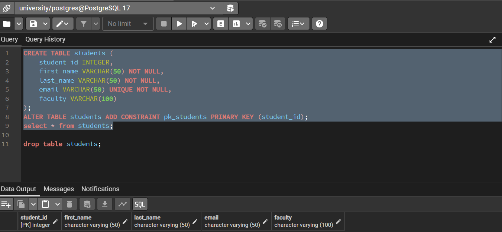
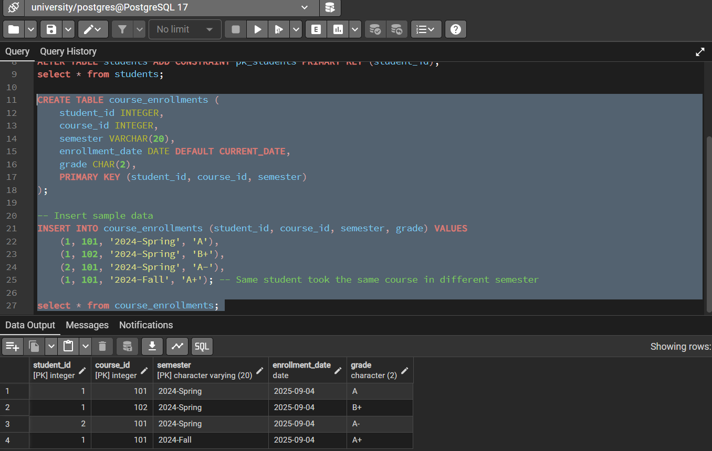
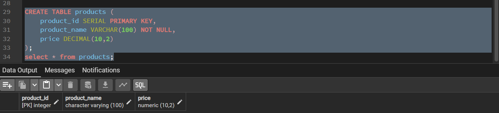
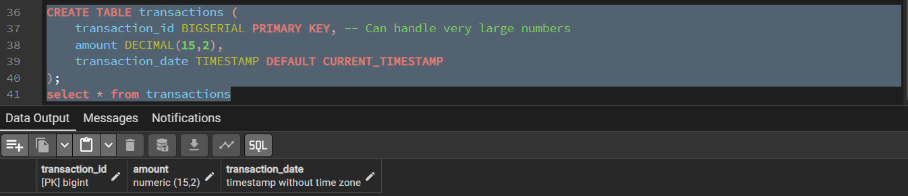
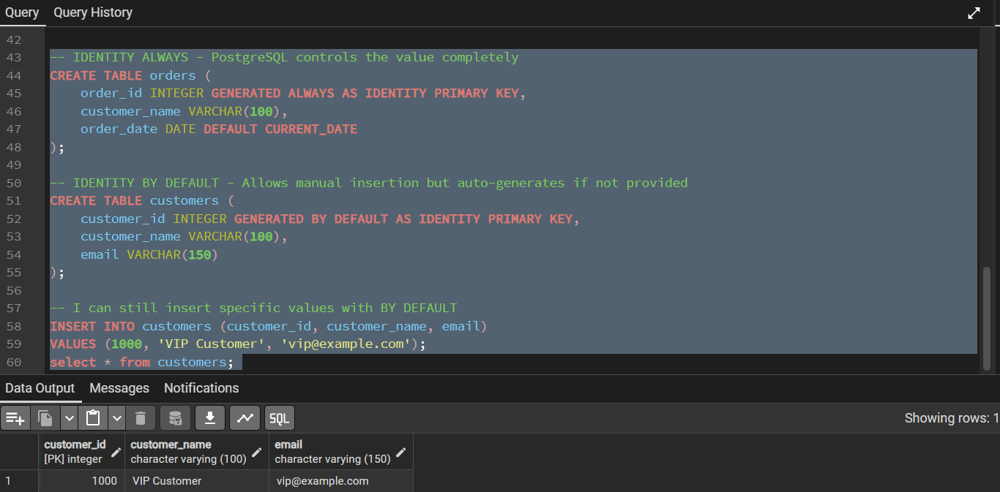
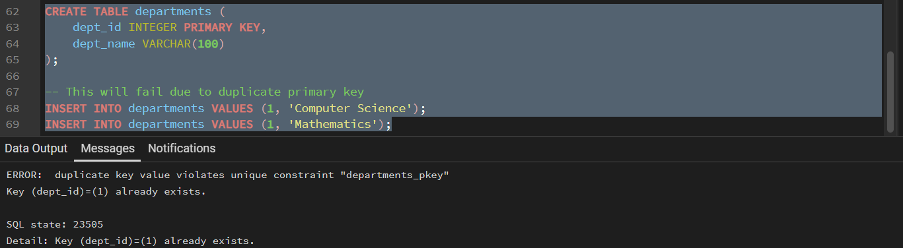
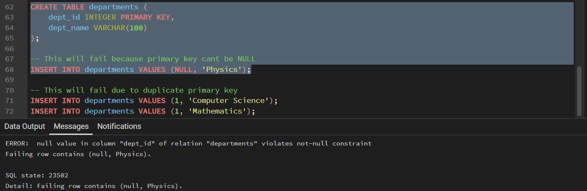
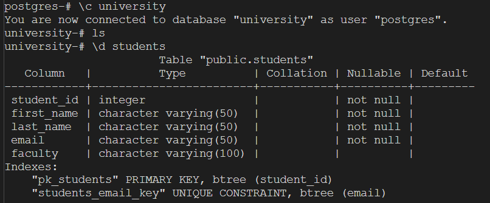

## Creating primary keys
---
### Method 1: Column-level Constraint

### Method 2: Table-level Constraint

### Method 3: Named Constraint

### Adding primary key to existing table

### Single vs Composite primary keys
---
So far, I have only used single primary keys, using only one column. Let's use the composite primary key:

## AUTO_INCREMENT equivalent (SERIAL, IDENTITY)
---
### Single:

### Bigserial:

## IDENTITY Columns:

## Primary key constraints
---
### UNIQUE

### NOT NULL

### Automatic Index Creation

