---

---
## **SELECT statements**
---
The SELECT statement is the starting point for every query. It's used to specify which columns you want to retrieve from a table.

**Syntax:**
`SELECT column1, column2, ...`  
`FROM table_name;`

**Examples:**
Select all columns from the customers table:

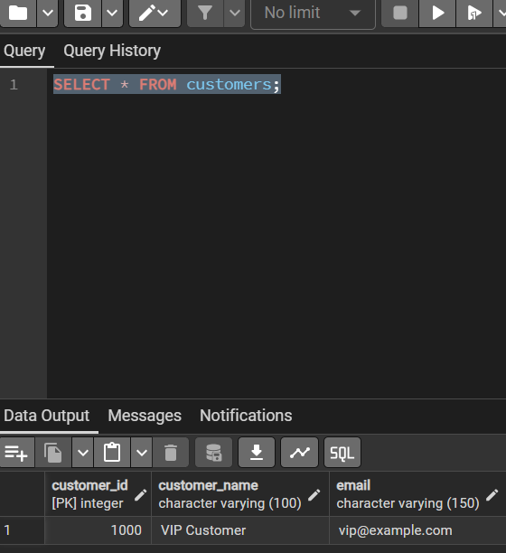

**Select specific columns**

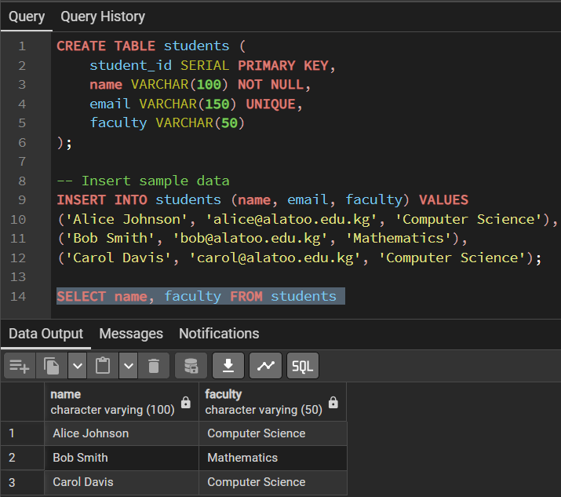

**Perform calculations on the fly. This query calculates a 10% bonus for each employee:**

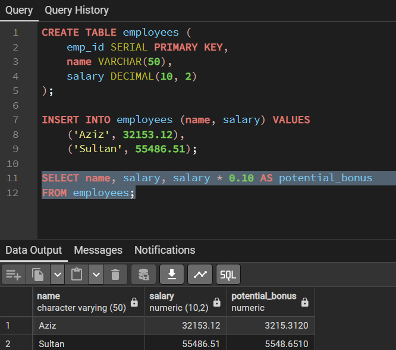

**Note: The AS keyword is used to alias (rename) a column or calculation in the output.**

## **WHERE clause conditions**
---
**The WHERE clause is used to filter records and return only those that meet a specified condition. It comes after the FROM clause.**

**Syntax:**
`SELECT column1, column2`  
`FROM table_name`  
`WHERE condition;`

***Common Operators:***
-     Comparison: =, <> or != (not equal), >, <, >=, <=
-     Logical: AND, OR, NOT
-     Range: BETWEEN (inclusive range)
-     Null Check: IS NULL, IS NOT NULL

**Examples:**
**Find all employees in the 'Sales' department:**

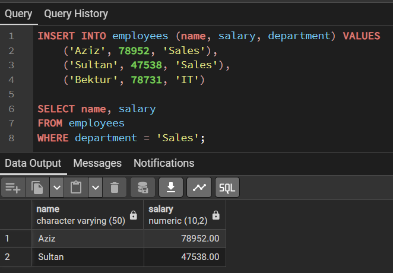

**Find employees with a salary greater than 75,000 in the 'Engineering' department:**

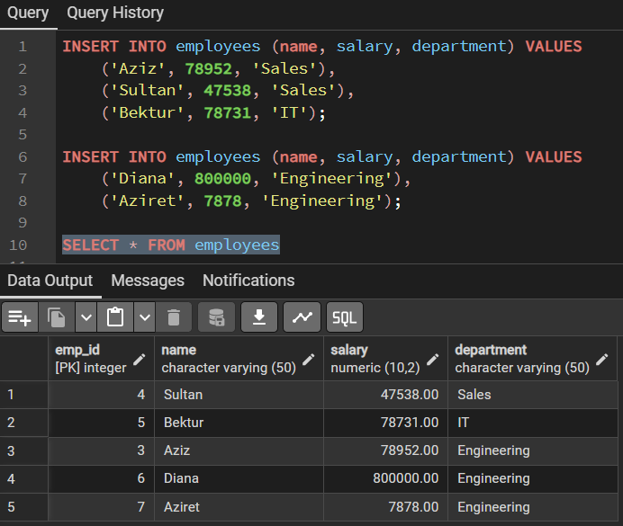

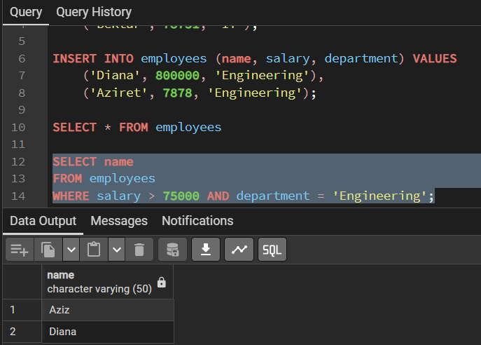

**Find products with a price between 20 and 50 dollars:**

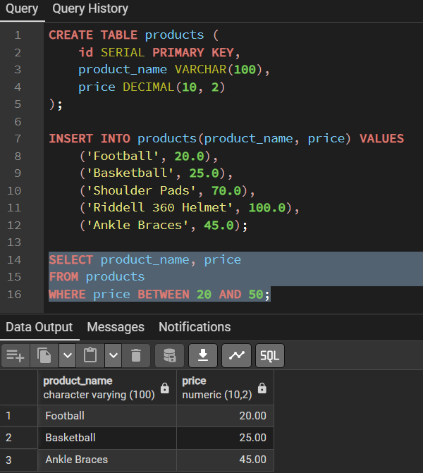

## **Pattern matching (LIKE, ILIKE)**
---
The LIKE and ILIKE operators are used in a WHERE clause to search for a specified pattern in a column.
- % represents zero, one, or multiple characters.
- _ represents a single character.
- ILIKE is a PostgreSQL-specific operator that is case-insensitive.

**Examples:
Find products whose name ends with 'berry' (e.g., Strawberry, Blueberry):

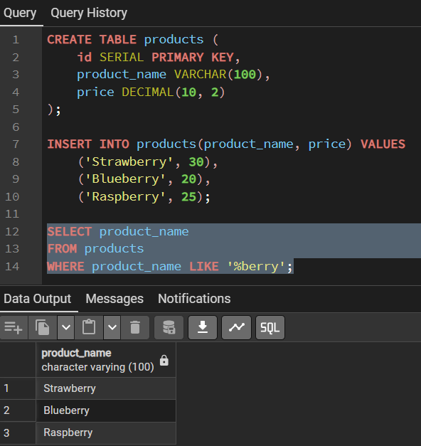

## **Regular expressions**
---
For more complex pattern matching than LIKE can handle, PostgreSQL offers powerful Regular Expression operators. The most common is ~.
- ~ : Case-sensitive regular expression match
- ~* : Case-insensitive regular expression match
- !~ : Does not match (case-sensitive)    
- !~* : Does not match (case-insensitive)

**Examples:**
**Find names that start with 'A' or 'B':**

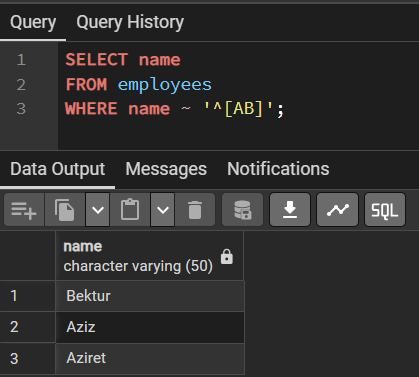

## **IN and EXISTS operators**
---
**These operators are used to check if a value is present in a set of results.

***IN:*** Used to check if a value matches any value in a list or subquery. Best for static lists or small subqueries.

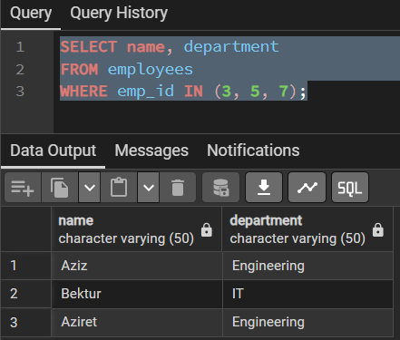

***EXISTS:*** Used to test for the existence of any rows in a subquery. It returns true if the subquery returns one or more rows. Often more efficient than IN for large datasets because it stops processing as soon as it finds one match.

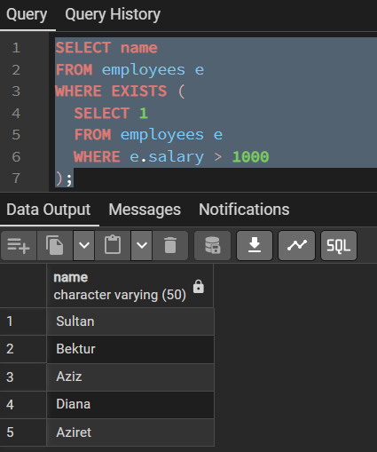

## **CASE statements**
---
**The CASE statement is the SQL equivalent of IF-THEN-ELSE logic. It's used to create conditional output inside your queries.**

**Syntax:**
`SELECT column1,`  
  `CASE`  
    `WHEN condition1 THEN result1`  
    `WHEN condition2 THEN result2`  
    `ELSE result_default`  
  `END AS new_column_name`  
`FROM table_name;`

**Example:**

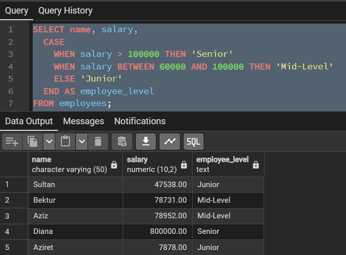

## **Common Table Expressions (CTEs)**
---
**CTEs (also called "WITH clauses") allow you to define a temporary named result set that you can reference within your main SELECT, INSERT, UPDATE, or DELETE statement. They are fantastic for breaking down complex queries into simple, logical parts.**

**Syntax:**
`WITH cte_name AS (`  
  `-- Subquery here`  
  `SELECT ...`  
  `FROM ...`  
  `WHERE ...`  
`)`  
`-- Main query that uses the CTE`  
`SELECT *`  
`FROM cte_name`  
`WHERE ...;`

**Example:**

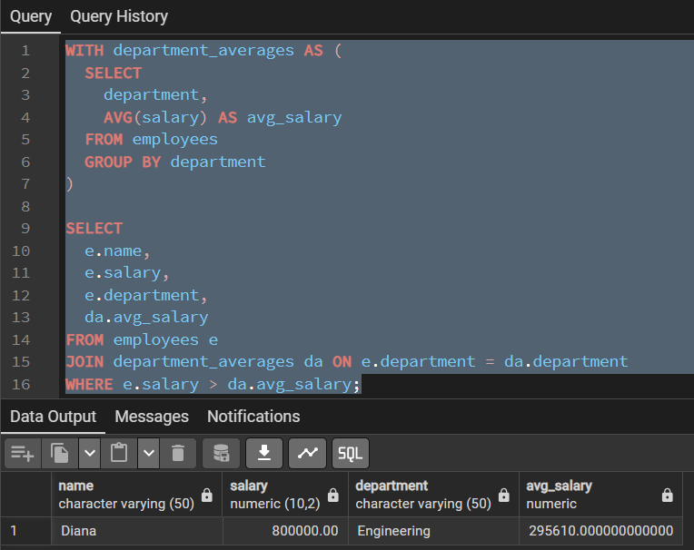