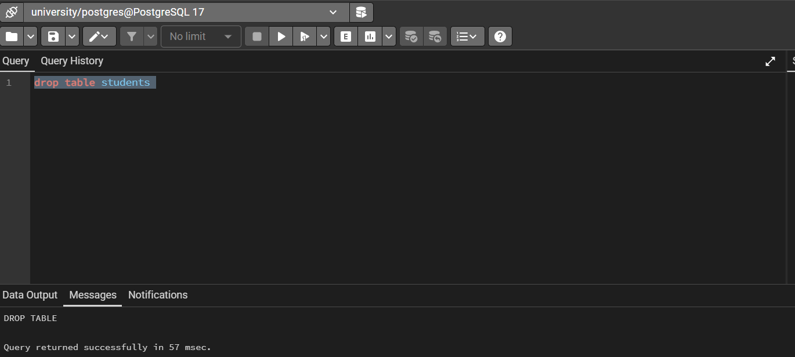
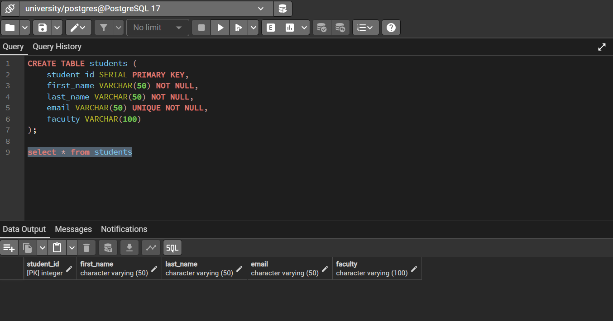
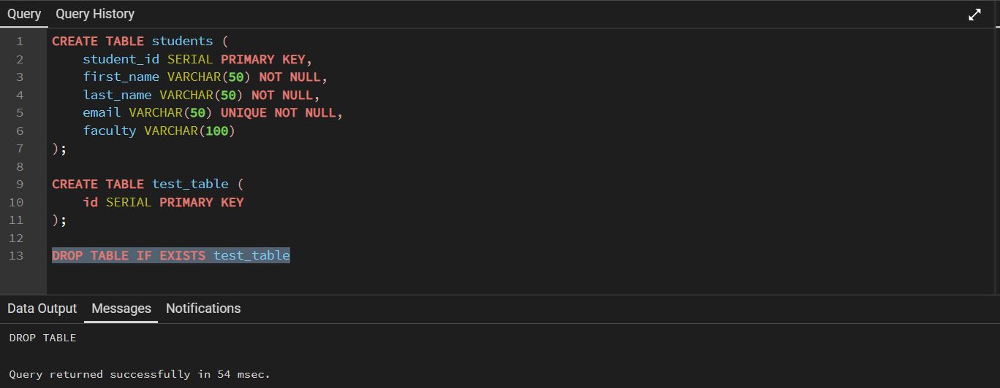
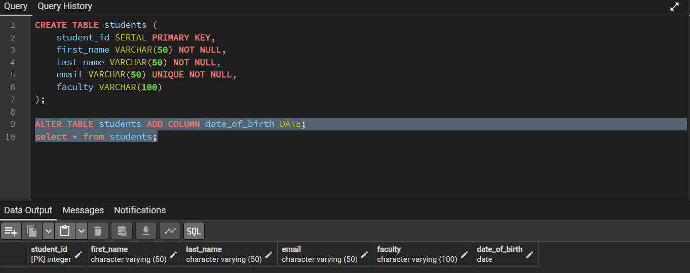
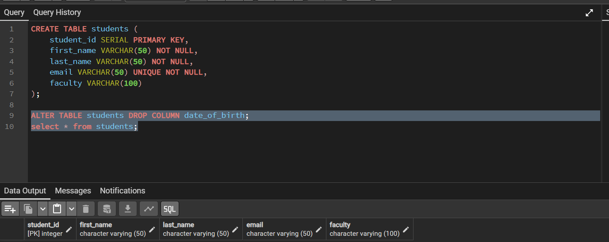
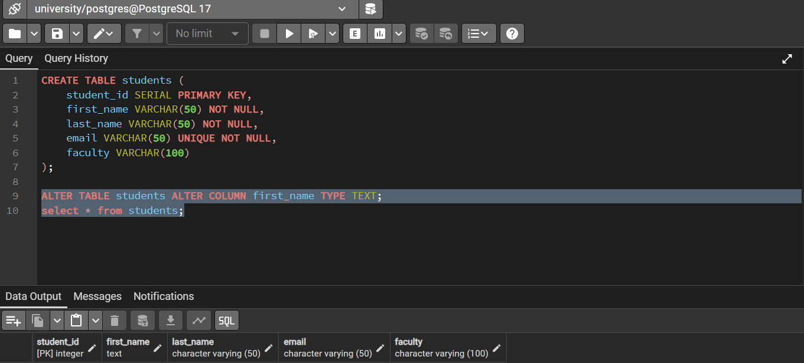
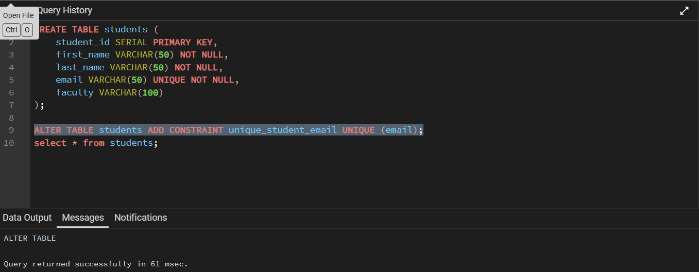
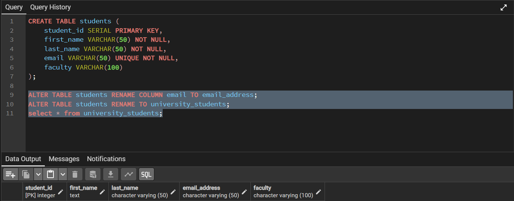
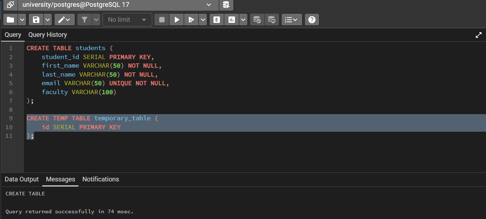

## Table Creation (CREATE TABLE)
---
So, let's drop our previous table to create it again:

As you can see it is here, I just didn't bother filling it up.

## Dropping Tables (DROP TABLE)
---
Now let's just create a test table to drop it:

## Altering Table Structure (ALTER TABLE)
---
### Adding a column 

### Dropping a column

### Changing a Column's Data Type

### Adding a constraint

### Renaming a Column or Table

## Temporary tables

