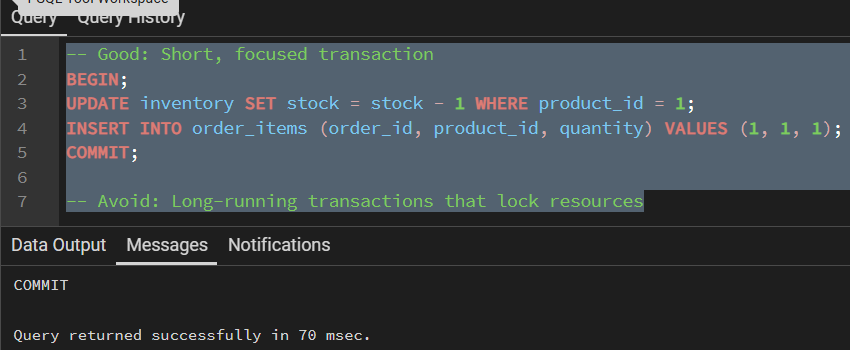

A transaction is a sequence of one or more SQL operations that are treated as a single logical unit of work. Either all operations in the transaction succeed (commit), or none of them do (rollback). This ensures data consistency and integrity in the database. Think of a transaction like a bank transfer: when you transfer money from Account A to Account B, two operations must happen - deducting from Account A and adding to Account B. Both must succeed, or neither should happen. A transaction ensures this "all-or-nothing" behavior.

**Key characteristics of transactions:**
- **Atomicity:** All operations succeed or all fail
- **Consistency:** Database moves from one valid state to another
- **Isolation:** Concurrent transactions don't interfere with each other
* **Durability:** Committed changes are permanently stored

## **BEGIN, COMMIT, ROLLBACK**
---
PostgreSQL provides three main commands to control transactions:

### **BEGIN - Start a new transaction**
`BEGIN;`  
`-- or alternatively`  
`BEGIN TRANSACTION;`  
`-- or simply`  
`START TRANSACTION;`

### **COMMIT - Save all changes made in the transaction**

### **ROLLBACK - Undo all changes made in the transaction**

## **ACID properties in detail**
---
ACID is an acronym that describes the four fundamental properties that guarantee reliable database transactions:

### **ATOMICITY**
- Ensures that all operations within a transaction are completed successfully or none at all
- If any operation fails, the entire transaction is rolled back
- Creates an "all-or-nothing" scenario

### **CONSISTENCY**
- Ensures the database moves from one valid state to another
- All database rules, constraints, and triggers are satisfied
- Data integrity is maintained throughout the transaction

### **ISOLATION**
- Ensures that concurrent transactions don't interfere with each other
- Each transaction appears to execute in isolation from others
- Controlled by isolation levels (discussed below)

### **DURABILITY**
- Once a transaction is committed, changes are permanent
- Data survives system crashes, power failures, etc.
- Changes are stored in non-volatile storage

## **Isolation levels**
---
Isolation levels control how transactions interact with each other. PostgreSQL supports four standard isolation levels:

### **READ UNCOMMITTED**
- Lowest isolation level
- Allows dirty reads (reading uncommitted changes from other transactions)
- Rarely used in practice

### **READ COMMITTED (Default)**
- Most commonly used isolation level
- Prevents dirty reads
- Allows non-repeatable reads and phantom reads

### **REPEATABLE READ**
- Prevents dirty reads and non-repeatable reads
- Same SELECT query returns same results throughout transaction
- May still experience phantom reads

### **SERIALIZABLE**
- Highest isolation level
- Prevents all read phenomena (dirty reads, non-repeatable reads, phantom reads)
- Transactions appear to execute serially

**Setting session-level isolation:**
`SET TRANSACTION ISOLATION LEVEL REPEATABLE READ;`

## **Savepoints**
---
Savepoints allow you to create intermediate points within a transaction that you can rollback to without rolling back the entire transaction.

### **Creating and using savepoints:**

### **Multiple savepoints:**

## **Transaction best practices**
---
### **Keep transactions short and focused**

### **Handle errors properly**

### **Use appropriate isolation levels**

**-- For financial operations, use higher isolation**
`BEGIN TRANSACTION ISOLATION LEVEL SERIALIZABLE;`  
`-- Critical financial operations here`  
`COMMIT;`  
  
`-- For reporting, READ COMMITTED is usually sufficient`  
`BEGIN TRANSACTION ISOLATION LEVEL READ COMMITTED;`  
`-- Generate reports here`  
`COMMIT;`

### **Use savepoints for complex operations**

### **Monitor transaction locks and deadlocks**

### **Use explicit transactions for multiple operations**

