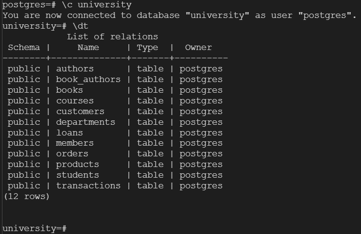
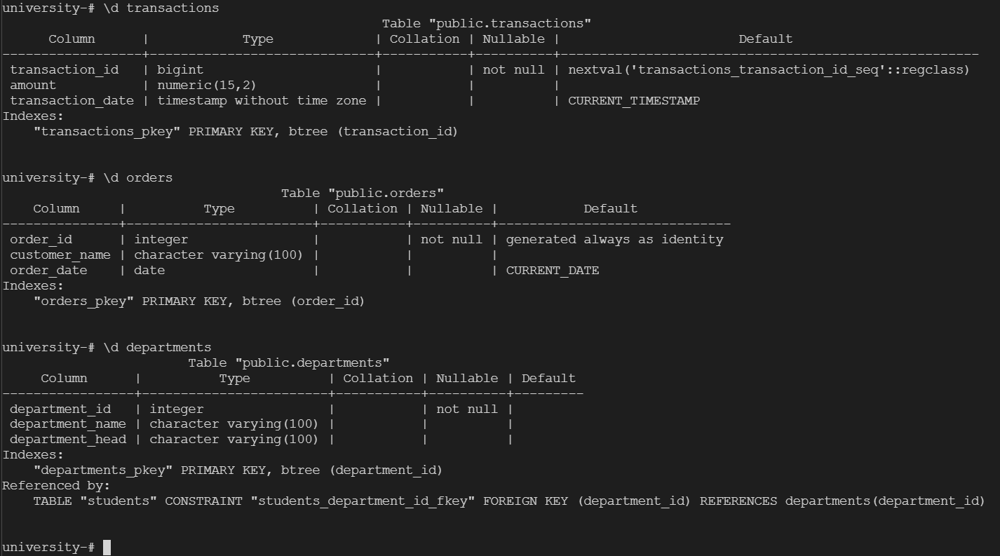
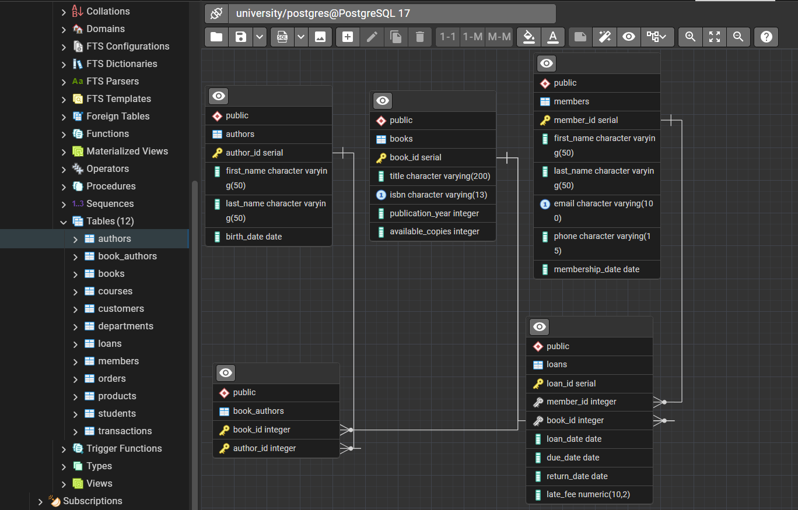

When working with a database, it is important to understand its structure: what tables exist, what columns they have, data types, and relationships between tables. In PostgreSQL, there are built-in tools in psql for this purpose, as well as external visualization tools such as ER diagrams.

## **\dt and \d commands**
---
**\dt - shows all tables in current DB:**

**\d table_name - describe the exact table structure**

## **ER diagrams**
---
**ER diagrams are graphical representation of database structure  

### **How to view ER Digram via pgAdmin?**
**DB section → Schemas → Tables → Right click → ERD for database**

